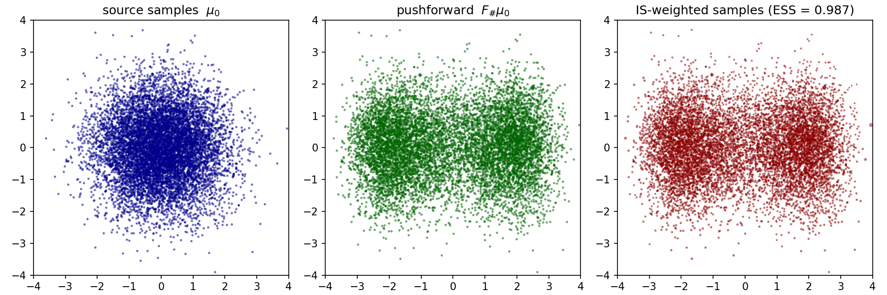

# zflows

A small convenience wrapper around [zuko](https://github.com/probabilists/zuko) for energy-based normalizing flows on user-specified rectangular regions.

> This project was developed with [Claude Code](https://claude.com/claude-code).

## Motivation

`zuko` ships excellent normalizing-flow primitives but does not, out of the box:

- restrict a flow to a user-specified box `[a_1, b_1] x ... x [a_d, b_d]` (its splines live on a fixed symmetric box);
- bundle the small bookkeeping needed to train a flow against an unnormalized target potential (source/target potentials, KL loss, importance-sampling diagnostics).

`zflows` fills that gap with a minimal, runnable wrapper.

## What's in the package

- `NSF` — a Neural Spline Flow whose transform is a bijection on `[a, b]^d`, with `a, b` accepting `Tensor` or `list[float]`.
- `Potential`, `Uniform`, `Gaussian` — `nn.Module` potentials returning `U(x)` and supporting `.samples(N)`.
- `compute_ESS`, `compute_ESS_log`, `compute_CESS`, `compute_CESS_log`, `resample` — importance-sampling diagnostics in linear and log space (the log-space variants use `logsumexp` for stability).

## Minimal example

See [`tests/test_2D_reverse_KL.ipynb`](tests/test_2D_reverse_KL.ipynb) (or the script [`tests/test_2D_reverse_KL.py`](tests/test_2D_reverse_KL.py)) for an end-to-end run that trains an NSF to push a 2D Gaussian source onto a target specified only by an unnormalized energy, then evaluates the result via importance sampling and ESS.



## Install

```bash
pip install -e .
```
