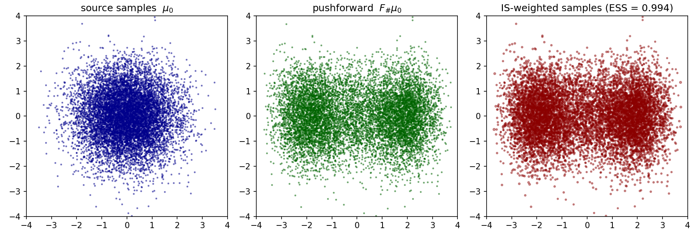
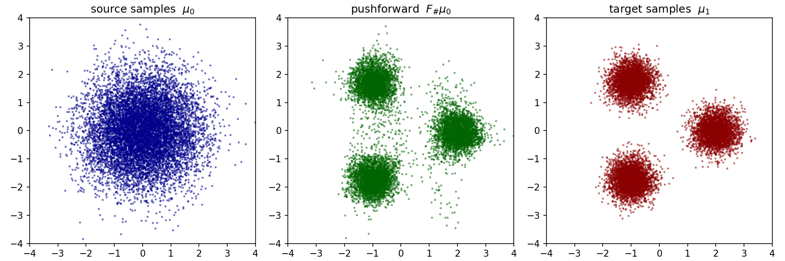

# zflows

A small convenience wrapper around [zuko](https://github.com/probabilists/zuko) for normalizing flows on user-specified rectangular regions.

> This project was developed with [Claude Code](https://claude.com/claude-code).

## Motivation

`zuko` ships excellent normalizing-flow primitives but does not, out of the box:

- restrict a flow to a user-specified box `[a_1, b_1] x ... x [a_d, b_d]` (its splines live on a fixed symmetric box);
- bundle the small bookkeeping needed to train a flow against an unnormalized target potential (source/target potentials, KL loss, importance-sampling diagnostics).

`zflows` fills that gap with a minimal, runnable wrapper.

## What's in the package

- `NSF` — a Neural Spline Flow whose transform is a bijection on `[a, b]^d`, with `a, b` accepting `Tensor` or `list[float]`.
- `Potential`, `Uniform`, `Gaussian` — `nn.Module` potentials returning `U(x)` and supporting `.samples(N)`.
- `reverse_KL`, `forward_KL` — ready-to-use loss functions for energy-based and data-driven training.
- `compute_ESS`, `compute_ESS_log`, `compute_CESS`, `compute_CESS_log`, `resample` — importance-sampling diagnostics in linear and log space (the log-space variants use `logsumexp` for stability).

## Installation

`zflows` is a pure-Python package; the only runtime dependencies are [`torch`](https://pytorch.org) and [`zuko`](https://github.com/probabilists/zuko), which `pip` will resolve automatically.

**1. Clone the repository.**

```bash
git clone https://github.com/xuda-ye-math/zflows.git
cd zflows
```

**2. Install in editable mode.** This registers the package with your active Python environment while leaving the source tree in place, so any local edits take effect immediately:

```bash
pip install -e .
```

**3. Verify the install.**

```bash
python -c "import zflows; print(zflows.__doc__)"
```

**Uninstall.**

```bash
pip uninstall zflows
```

## Mathematical background

> **Note.** GitHub's markdown viewer does not render LaTeX math reliably. For properly typeset formulas, clone the repository and open `README.md` in VS Code.

Sampling problems on $\mathbb R^d$ fall into two broad categories:

- **Energy-based sampling.** Given a confining potential $U_1(x)$ on $\mathbb R^d$, draw samples from the Boltzmann distribution $\mu_1 \propto \exp(-U_1)$.
- **Data-driven sampling.** Given empirical samples from a distribution $\mu_1$ with unknown density, generate further samples from $\mu_1$.

Despite their different setups, both reduce in the normalizing-flow framework to the same recipe: pick a tractable source distribution $\mu_0 \propto \exp(-U_0)$ and learn a diffeomorphism $F$ such that $F_{\#}\mu_0 \approx \mu_1$. The change-of-variable formula gives the pushforward density
$$
(F_{\#}\mu_0)(y) = \frac{\mu_0(x)}{|\det J_F(x)|}, \qquad y = F(x),
$$
where $J_F(x) \in \mathbb R^{d \times d}$ is the Jacobian of $F$ at $x$. The training objective is the $\mathrm{KL}$ divergence between $F_{\#}\mu_0$ and $\mu_1$.

For energy-based sampling we use the **reverse $\mathrm{KL}$**, which involves only the energy $U_1$ and not its normalizing constant:
$$
\begin{aligned}
\mathrm{KL}(F_{\#}\mu_0 \| \mu_1)
& = \int_{\mathbb R^d} (F_{\#}\mu_0)(y) \log \frac{(F_{\#}\mu_0)(y)}{\mu_1(y)} \, \mathrm{d}y \\
& = \mathbb E_{x \sim \mu_0} \Bigl[ U_1(F(x)) - U_0(x) - \log |\det J_F(x)| \Bigr] + \mathrm{const}.
\end{aligned}
$$
Dropping the (parameter-independent) constant yields the trainable loss
$$
\mathcal L_{\mathrm{reverse}}[F] = \mathbb E_{x \sim \mu_0} \Bigl[ U_1(F(x)) - \log |\det J_F(x)| \Bigr].
$$

For data-driven sampling we use the **forward $\mathrm{KL}$**, which is obtained by simply exchanging the positions of $F_{\#}\mu_0$ and $\mu_1$ in the $\mathrm{KL}$ divergence:
$$
\begin{aligned}
\mathrm{KL}(\mu_1 \| F_{\#}\mu_0 )
& = \int_{\mathbb R^d} \mu_1(y) \log \frac{\mu_1(y)}{(F_{\#}\mu_0)(y)} \, \mathrm{d}y \\
& = \mathbb E_{y \sim \mu_1} \Bigl[ U_0(F^{-1}(y)) + \log |\det J_F(F^{-1}(y))| \Bigr] + \mathrm{const}.
\end{aligned}
$$
which gives the trainable loss
$$
\mathcal L_{\mathrm{forward}}[F] = \mathbb E_{y \sim \mu_1} \Bigl[ U_0(F^{-1}(y)) + \log |\det J_F(F^{-1}(y))| \Bigr].
$$

In both cases, once $F$ is trained, new samples from $\mu_1$ are generated by pushing fresh samples from $\mu_0$ through $F$.

## Minimal examples

Two end-to-end scripts are provided, one per training mode. Run either from the project root:

**Energy-based (reverse $\mathrm{KL}$).** [`tests/2D_reverse_KL.py`](tests/2D_reverse_KL.py) trains an NSF to push a 2D Gaussian source onto a target specified only by an unnormalized energy $U_1(x) = \tfrac{1}{2}|x|^2 + 2\cos x_1$, then evaluates the residual mismatch via importance sampling and ESS.

```bash
python -m tests.2D_reverse_KL
```



**Data-driven (forward $\mathrm{KL}$).** [`tests/2D_forward_KL.py`](tests/2D_forward_KL.py) trains an NSF on samples from a 3-mode Gaussian mixture target — only `u1.samples(N)` is ever called, mimicking a real data-driven setting.

```bash
python -m tests.2D_forward_KL
```


