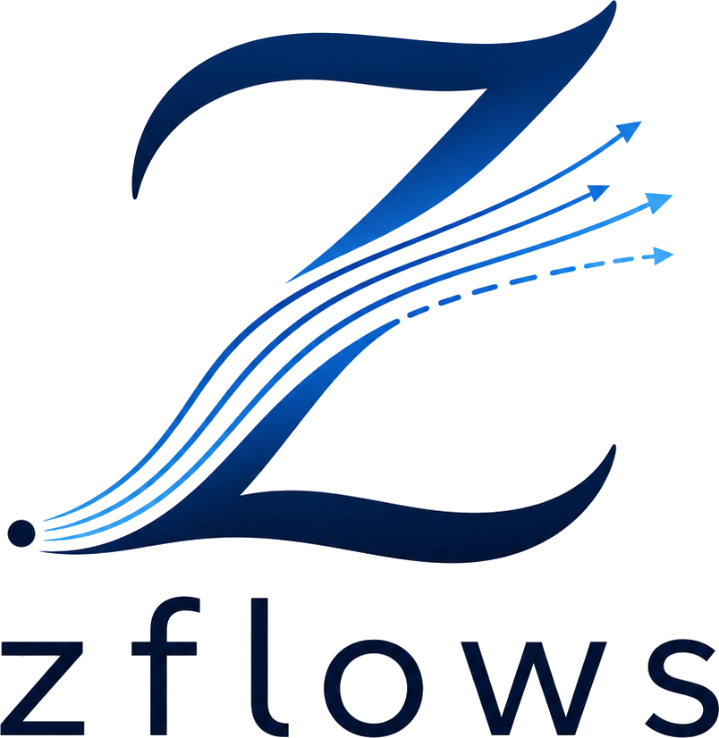
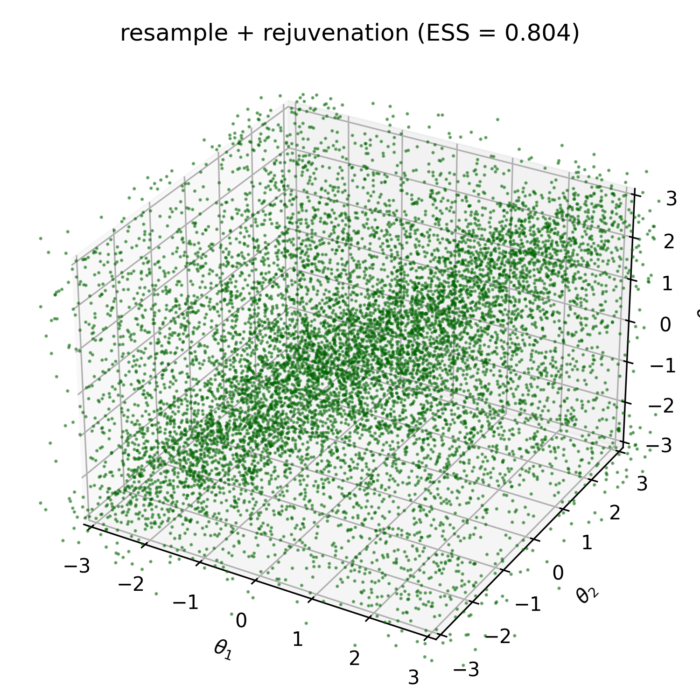
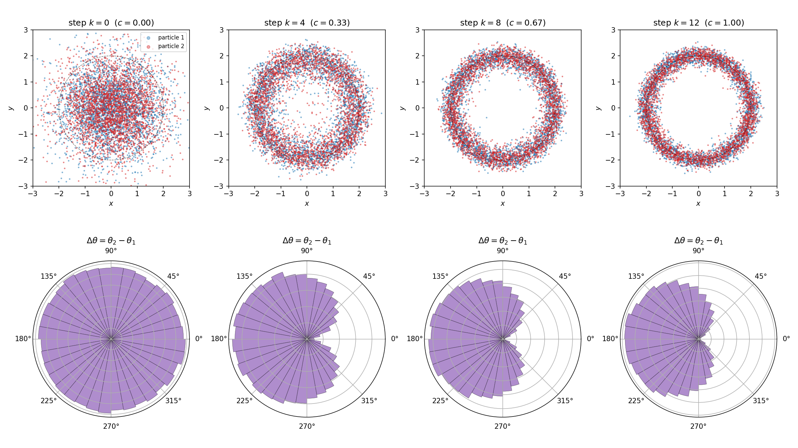
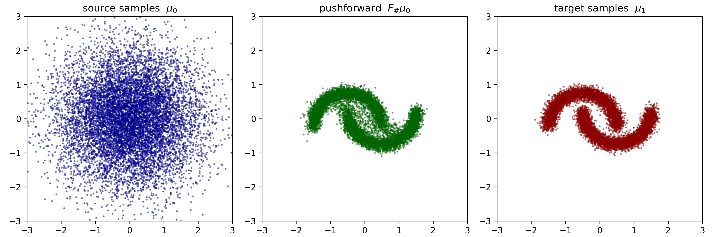

<p align="center"></p>
<p align="center"><sub><em>designed by ChatGPT</em></sub></p>

# zflows

A small convenience wrapper around [zuko](https://github.com/probabilists/zuko) for normalizing flows, with first-class support for energy-based sampling.

> **Status: experimental.** Tested only on **Linux + NVIDIA GPU**. On Windows, please use [WSL](https://github.com/microsoft/WSL) or avoid `Potential.enable_grad` — `torch.compile` is not supported there (see [pytorch/pytorch#167062](https://github.com/pytorch/pytorch/issues/167062)).
>
> This project was developed with [Claude Code](https://claude.com/claude-code).

## Features

**Flexible flow classes and hyperparameters, one unified interface.** Three flow classes are supported — **NSF** (Neural Spline Flow), **NCSF** (Neural *Circular* Spline Flow, for periodic / angular features), and **CNF** (Continuous Normalizing Flow / FFJORD) — with the constructors

```python
NSF(a, b, bins=8, slope=1e-3, transforms=4, hidden_features=(64, 64), activation=nn.SiLU)
NCSF(a, b, bins=8, slope=1e-3, transforms=4, hidden_features=(64, 64), activation=nn.SiLU)
CNF(dimension, frequency=3, exact=True, hidden_features=(64, 64), activation=nn.SiLU)
```

all subclassing the same `Flow` [abstract class](https://docs.python.org/3/library/abc.html) (`nn.Module` + `abc.ABC`):

```python
flow = NSF(...) # or NCSF(...) or CNF(...)
F = flow.t() # bijection
y, ladj = F.call_and_ladj(x) # forward & log|det J|
x_back = F.inv(y) # inverse
```

Swapping NSF for CNF is a one-line change. Per-class hyperparameters are documented in [`flow.py`](zflows/flow.py).

**Precompiled gradients on `Potential`.** Any subclass of `Potential` opts into a `torch.compile`-compiled `vmap(grad(u))` with a single call:

```python
u = Potential_U().to(device).enable_grad()
g = u.grad(x) # x: [N, d] -> g: [N, d], no requires_grad_ on x needed
```

The gradient closure is built once, cached on the instance, and reused every call — making heavy-load Langevin / MALA sampling fast (one fused kernel per step instead of an autograd graph rebuild). The call is idempotent and chainable; calling `.grad()` without `.enable_grad()` raises a clear `RuntimeError`.

**One-line KL losses.** `reverse_KL(x, target, flow)` and `forward_KL(y, source, flow)` are direct-call functions returning a scalar loss — drop them straight into a training loop, no boilerplate.

**SMC-style utilities.** `resample(samples, weights)` for multinomial resampling; `langevin(samples, potential, step, iters, adjust=False, chunk=1)` (alias `rejuvenation`) for overdamped Langevin updates, with `adjust=True` switching from plain ULA to MALA (Metropolis-adjusted Langevin) and `chunk` bounding peak VRAM by splitting the batch; `compute_ESS`, `compute_ESS_log`, `compute_CESS`, `compute_CESS_log` for importance-sampling diagnostics, with log-space variants using `logsumexp` for numerical stability.

Together these compose into a complete *propose → reweight → resample → rejuvenate* pipeline with no glue code on the user side.

## Installation

`zflows` is pure Python; runtime dependencies ([`torch`](https://pytorch.org), [`zuko`](https://github.com/probabilists/zuko)) are resolved automatically by `pip`.

**1. Clone the repository.**

```bash
git clone https://github.com/xuda-ye-math/zflows.git
cd zflows
```

**2. Install in editable mode.** Local edits take effect immediately:

```bash
pip install -e .
```

**3. Verify the install.**

```bash
python -c "import zflows; print(zflows.__doc__)"
```

**Uninstall.**

```bash
pip uninstall zflows
```

## Mathematical background

<details>
<summary>click to expand; renders best in VS Code</summary>

Sampling problems on $\mathbb R^d$ (or on a torus) fall into two broad categories:

- **Energy-based sampling.** Given a confining potential $U_1(x)$, draw samples from the Boltzmann distribution $\mu_1 \propto \exp(-U_1)$.
- **Data-driven sampling.** Given empirical samples from a distribution $\mu_1$ with unknown density, generate further samples from $\mu_1$.

Both reduce in the normalizing-flow framework to the same recipe: pick a tractable source $\mu_0 \propto \exp(-U_0)$ and learn a diffeomorphism $F$ such that $F_{\#}\mu_0 \approx \mu_1$. The change-of-variable formula gives the pushforward density
$$
(F_{\#}\mu_0)(y) = \frac{\mu_0(x)}{|\det J_F(x)|}, \qquad y = F(x),
$$
where $J_F(x) \in \mathbb R^{d \times d}$ is the Jacobian of $F$ at $x$. The training objective is the $\mathrm{KL}$ divergence between $F_{\#}\mu_0$ and $\mu_1$.

For energy-based sampling we use the **reverse $\mathrm{KL}$**, which involves only the energy $U_1$ and not its normalizing constant:

$$
\begin{aligned}
\mathrm{KL}(F_{\#}\mu_0 \| \mu_1)
& = \int (F_{\#}\mu_0)(y) \log \frac{(F_{\#}\mu_0)(y)}{\mu_1(y)} \, \mathrm{d}y \\
& = \mathbb E_{x \sim \mu_0} [ U_1(F(x)) - U_0(x) - \log |\det J_F(x)| ] + \mathrm{const}.
\end{aligned}
$$

Dropping the (parameter-independent) constant yields the trainable loss

$$
\mathcal L_{\mathrm{reverse}}[F] = \mathbb E_{x \sim \mu_0} [ U_1(F(x)) - \log |\det J_F(x)| ].
$$

For data-driven sampling we use the **forward $\mathrm{KL}$**, obtained by exchanging the positions of $F_{\#}\mu_0$ and $\mu_1$ in the $\mathrm{KL}$ divergence:

$$
\begin{aligned}
\mathrm{KL}(\mu_1 \| F_{\#}\mu_0)
& = \int \mu_1(y) \log \frac{\mu_1(y)}{(F_{\#}\mu_0)(y)} \, \mathrm{d}y \\
& = \mathbb E_{y \sim \mu_1} [ U_0(F^{-1}(y)) + \log |\det J_F(F^{-1}(y))| ] + \mathrm{const}.
\end{aligned}
$$

which gives the trainable loss

$$
\mathcal L_{\mathrm{forward}}[F] = \mathbb E_{y \sim \mu_1} [ U_0(F^{-1}(y)) + \log |\det J_F(F^{-1}(y))| ].
$$

In both cases, once $F$ is trained, new samples from $\mu_1$ are generated by pushing fresh samples from $\mu_0$ through $F$.

</details>

## Numerical Experiment

Several end-to-end scripts are provided. Run from the project root:

<details open>
<summary><strong>1. Energy-based normalizing flow (reverse KL)</strong></summary>

[`tests/2D_reverse_KL.py`](tests/2D_reverse_KL.py) (writeup: [`tests/2D_reverse_KL.md`](tests/2D_reverse_KL.md)) trains an `NSF` on a target specified only by an unnormalized energy $U_1(x) = \tfrac{1}{2}|x|^2 + 2\cos x_1$, then evaluates residual mismatch via importance sampling and $\mathrm{ESS}$.

```bash
python -m tests.2D_reverse_KL
```

<p align="center"></p>

</details>

<details open>
<summary><strong>2. Data-driven normalizing flow (forward KL)</strong></summary>

[`tests/2D_forward_KL.py`](tests/2D_forward_KL.py) (writeup: [`tests/2D_forward_KL.md`](tests/2D_forward_KL.md)) trains an `NSF` on samples from a 3-mode Gaussian mixture — only `u1.samples(N)` is ever called.

```bash
python -m tests.2D_forward_KL
```

<p align="center"></p>

</details>

<details open>
<summary><strong>3. Periodic target with rejuvenation</strong></summary>

[`tests/3D_periodic.py`](tests/3D_periodic.py) (writeup: [`tests/3D_periodic.md`](tests/3D_periodic.md)) trains an `NCSF` on a von-Mises ridge mixture on the 3-torus $[-\pi, \pi]^3$, then runs the full pipeline: importance sampling → resample → `enable_grad` → Langevin rejuvenation.

```bash
python -m tests.3D_periodic
```

<p align="center"></p>

</details>

<details open>
<summary><strong>4. Annealed Boltzmann generator (4D, two repelling charges)</strong></summary>

[`tests/4D_Boltzmann_generator.py`](tests/4D_Boltzmann_generator.py) (writeup: [`tests/4D_Boltzmann_generator.md`](tests/4D_Boltzmann_generator.md)) trains an `NSF` on the 4D target of two charges in $\mathbb R^2$ confined to a soft annulus and repelling via a regularized 3D Coulomb. A direct flow proposal would have $\mathrm{ESS} \approx 0$, so we anneal: build $M{=}12$ bridge potentials $U_k = (1-c_k)U_0 + c_k U_1$ via `Linear_Combination`, and at each rung run *resample → reverse-KL train → IS → resample → MALA rejuvenation* with the same flow warm-started across rungs. The figure shows the marginal annulus forming (top row) and the joint relative-angle distribution $\Delta\theta = \theta_2 - \theta_1$ on $S^1$ shifting from uniform at $k=0$ to peaked at $\pm\pi$ at $k=12$ — the antipodal Coulomb minimum.

```bash
python -m tests.4D_Boltzmann_generator
```

<p align="center"></p>

</details>

<details open>
<summary><strong>5. Continuous normalizing flow on two moons (CNF / FFJORD)</strong></summary>

[`tests/2D_two_moon_CNF.py`](tests/2D_two_moon_CNF.py) (writeup: [`tests/2D_two_moon_CNF.md`](tests/2D_two_moon_CNF.md)) trains a `CNF` (FFJORD-style continuous normalizing flow) by forward-KL on samples from the classic two-moons distribution — a target whose interlocking-arc topology cannot be separated along any axis. The point of this test is to (i) exercise the `CNF` class on a target where its smooth, non-axis-aligned deformation actually pays off, and (ii) make the CNF/NSF trade-off concrete: closed-form O(d) splines vs. an adaptive ODE flow that buys topological flexibility at the cost of 50–500× slower importance sampling. The writeup includes a side-by-side comparison of the two flow classes across the operations a typical energy-based pipeline performs.

```bash
python -m tests.2D_two_moon_CNF
```

<p align="center"></p>

</details>
