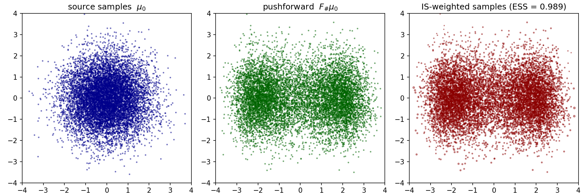
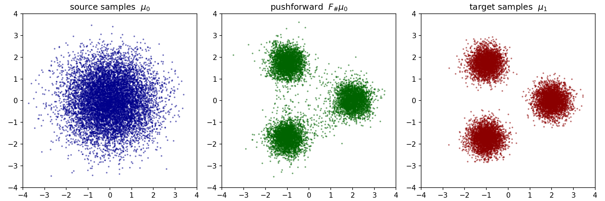
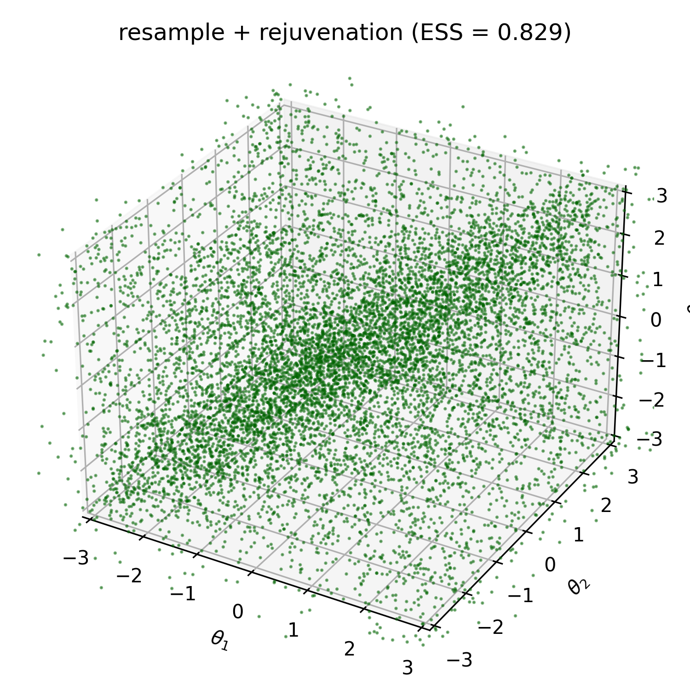
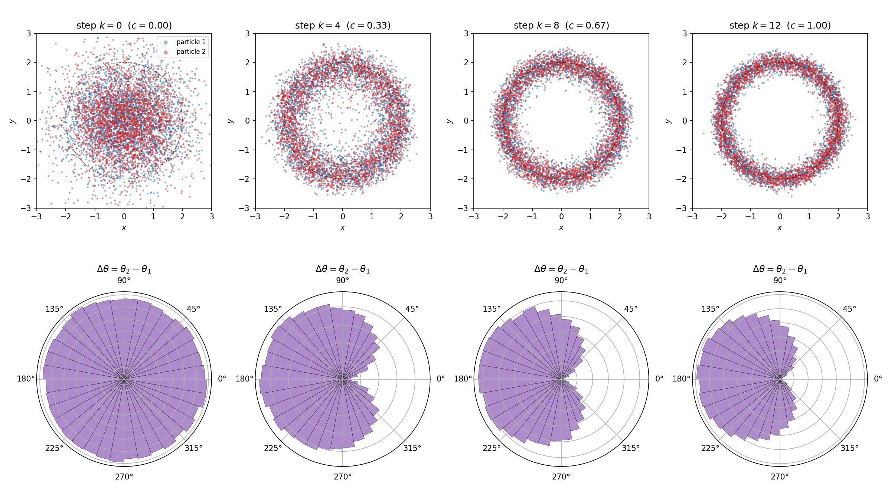
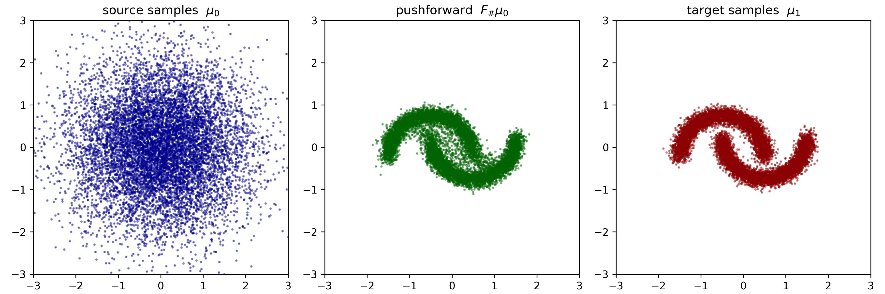
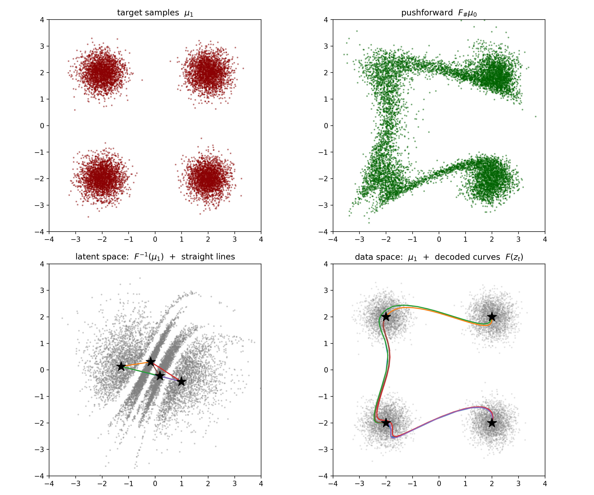

<p align="center"></p>
<p align="center"><sub><em>designed by ChatGPT</em></sub></p>

# zflows

PyTorch normalizing flows for unconditional energy-based sampling and Boltzmann generator.

> **Status: experimental.** Tested only on **Linux + NVIDIA GPU**. On Windows, please use [WSL](https://github.com/microsoft/WSL) or do not use any compile features — `torch.compile` is not supported there (see [pytorch/pytorch#167062](https://github.com/pytorch/pytorch/issues/167062)).
>
> This project was developed with [Claude Code](https://claude.com/claude-code).

## Features

**Flexible flow classes and hyperparameters, one unified interface.** Four flow classes are supported — **NSF** (Neural Spline Flow), **NCSF** (Neural *Circular* Spline Flow, for periodic / angular domains), **CNF** (Continuous Normalizing Flow / FFJORD), and **RealNVP** (closed-form affine-coupling bijection on $\mathbb R^d$) — with the constructors

```python
from zflows.flow import NSF, NCSF, CNF, RealNVP

NSF(a=[0.0, 0.0], b=[1.0, 1.0], bins=8, slope=1e-3, transforms=4, randmask=True, hidden_features=(64, 64), activation=nn.SiLU)
NCSF(a=[-1.0, -1.0], b=[1.0, 1.0], bins=8, slope=1e-3, transforms=4, randmask=True, hidden_features=(64, 64), activation=nn.SiLU)
CNF(dimension=8, frequency=3, exact=True, hidden_features=(64, 64), activation=nn.SiLU)
RealNVP(dimension=8, transforms=4, randmask=True, hidden_features=(64, 64), activation=nn.SiLU)
```

all subclassing the same `Flow` [abstract class](https://docs.python.org/3/library/abc.html) (`nn.Module` + `abc.ABC`):

```python
from zflows.flow import NSF

flow = NSF(...) # or NCSF(...), CNF(...), RealNVP(...)
flow.zeros() # set to identity
F = flow.t() # flow map
y, ladj = F.call_and_ladj(x) # forward & log|det J|
x_back = F.inv(y) # inverse
```

Swapping one flow class for another is a one-line change. Per-class hyperparameters are documented in [`flow.py`](zflows/flow.py). Every flow class also exposes `flow.zeros()`, which initialises the network so that the flow map is exactly the identity. The `randmask: bool = True` parameter shared by `NSF`, `NCSF`, and `RealNVP` controls per-layer feature ordering — `True` (default) draws a fresh `torch.randperm(d)` each layer (recommended at $d \geq 4$), `False` uses the legacy `arange / arange.flip` alternation; seed externally with `torch.manual_seed(...)` for reproducibility.

**Precompiled gradients on `Potential`.** Any subclass of `Potential` opts into a `torch.compile`-compiled `vmap(grad(u))` with a single call:

```python
from zflows.potential import Potential

class U(Potential): # user-defined potential class
    def __init__(self):
        super().__init__()
    def forward(self, x: torch.Tensor) -> torch.Tensor:
        return ...

u = U().to(device).enable_grad()
g = u.grad(x) # x: [N, d] -> g: [N, d], no requires_grad_ on x needed
```

The gradient closure is built once, cached on the instance, and reused every call — making heavy-load Langevin / MALA sampling fast (one fused kernel per step instead of an autograd graph rebuild). The call is idempotent and chainable; calling `.grad()` without `.enable_grad()` raises a clear `RuntimeError`.

**One-line compilable KL losses.** `reverse_KL(x, target, F, beta=1.0)` and `forward_KL(y, source, F, beta=1.0)` are direct-call functions returning a scalar loss; `beta` is the inverse temperature scaling the potential. The natural training loop just calls them in place:

```python
from zflows.loss import reverse_KL

F = flow.t()

for x_batch in batches:
    loss = reverse_KL(x_batch, target, F, beta=1.0)
    optimizer.zero_grad(); loss.backward(); optimizer.step()
```

For heavy-load training (e.g. annealed Boltzmann generators with thousands of steps per bridge) wrap the loss once with `zflows.loss.compile(...)` to capture `(potential, transform)` as closure constants and fuse the forward into a CUDA graph — typically **4–10× faster per training step** ([benchmark](tests/compare_compiled_loss.md)). `beta` becomes a runtime argument of the returned closure, so adaptive / annealed schedules vary it across steps without triggering a recompile:

```python
import zflows
from zflows.loss import reverse_KL

F = flow.t()

loss_fn = zflows.loss.compile(reverse_KL, target, F, mode='reduce-overhead')

for x_batch in batches:
    loss = loss_fn(x_batch, beta=1.0)
    optimizer.zero_grad(); loss.backward(); optimizer.step()
```

The first few steps pay a one-time Triton / Inductor compile cost; every step after that is a single fused kernel replay. `mode='default'` is the safe choice; `mode='reduce-overhead'` uses CUDA Graphs and is fastest at small $d$. `beta` is internally cast to a 0-d tensor so a single compiled artifact handles every schedule value. Pair with `zflows.utils.suppress_warnings()` to silence the compile-time chatter.

**SMC-style utilities.** Direct-call building blocks for the *propose → reweight → resample → rejuvenate* loop, with optional inverse-temperature inputs (default `beta = 1.0` recovers the standard case):

```python
from zflows.utils import importance_weights, resample, langevin, hmc, compute_ESS, compute_CESS

importance_weights(samples, source, target, F, beta_source=1.0, beta_target=1.0, chunk=1)  # IS log-weights between tempered rungs
resample(samples, weights)                                                                 # multinomial resampling with replacement
langevin(samples, potential, beta=1.0, step=1e-3, iters=100, adjust=False, chunk=1)        # ULA; adjust=True -> MALA; alias: rejuvenation
hmc(samples, potential, beta=1.0, step=1e-2, iters=10, burns=10, chunk=1)                  # Hamiltonian Monte Carlo
compute_ESS(weights)                                                                       # importance-sampling diagnostic
compute_CESS(source_weights, importance_weights)                                           # conditional ESS diagnostic
```

`beta` controls the tempering for the samplers and lets `importance_weights` reweight between two tempered ladder rungs (e.g. anneal `beta_target` from 0 to 1 while holding `beta_source = 1`). `chunk` splits the batch along dim 0 to bound peak VRAM (statistically equivalent to `chunk=1`).

Together these compose into a complete *propose → reweight → resample → rejuvenate* pipeline with no glue code on the user side.

## Installation

`zflows` is pure Python; the only runtime dependency is [`torch`](https://pytorch.org), resolved automatically by `pip` (`numpy` is pulled in transitively).

**1. Clone the repository.**

```bash
git clone https://github.com/xuda-ye-math/zflows.git
cd zflows
```

**2. Install in editable mode.** Local edits take effect immediately:

```bash
pip install -e .
```

**3. Verify the install.**

```bash
python -c "import zflows; print(zflows.__doc__)"
```

**Importing.** Use the four submodules `flow`, `potential`, `loss`, `utils`, and call `help(foo_name)` to read the documents. For example:

```python
from zflows.flow import NSF, RealNVP
from zflows.potential import Potential, Gaussian
from zflows.loss import reverse_KL, forward_KL
from zflows.utils import importance_weights, compute_ESS, resample, langevin

help(NSF)
```

**Uninstall.**

```bash
pip uninstall zflows
```

## Mathematical background

<details>
<summary>click to expand; renders best in VS Code</summary>

Sampling problems on $\mathbb R^d$ (or on a torus) fall into two broad categories:

- **Energy-based sampling.** Given a confining potential $U_1(x)$, draw samples from the Boltzmann distribution $\mu_1 \propto \exp(-U_1)$.
- **Data-driven sampling.** Given empirical samples from a distribution $\mu_1$ with unknown density, generate further samples from $\mu_1$.

Both reduce in the normalizing-flow framework to the same recipe: pick a tractable source $\mu_0 \propto \exp(-U_0)$ and learn a diffeomorphism $F$ such that $F_{\#}\mu_0 \approx \mu_1$. The change-of-variable formula gives the pushforward density
$$
(F_{\#}\mu_0)(y) = \frac{\mu_0(x)}{|\det J_F(x)|}, \qquad y = F(x),
$$
where $J_F(x) \in \mathbb R^{d \times d}$ is the Jacobian of $F$ at $x$. The training objective is the $\mathrm{KL}$ divergence between $F_{\#}\mu_0$ and $\mu_1$.

For energy-based sampling we use the **reverse $\mathrm{KL}$**, which involves only the energy $U_1$ and not its normalizing constant:

$$
\begin{aligned}
\mathrm{KL}(F_{\#}\mu_0 \| \mu_1)
& = \int (F_{\#}\mu_0)(y) \log \frac{(F_{\#}\mu_0)(y)}{\mu_1(y)} \, \mathrm{d}y \\
& = \mathbb E_{x \sim \mu_0} [ U_1(F(x)) - U_0(x) - \log |\det J_F(x)| ] + \mathrm{const}.
\end{aligned}
$$

Dropping the (parameter-independent) constant yields the trainable loss

$$
\mathcal L_{\mathrm{reverse}}[F] = \mathbb E_{x \sim \mu_0} [ U_1(F(x)) - \log |\det J_F(x)| ].
$$

For data-driven sampling we use the **forward $\mathrm{KL}$**, obtained by exchanging the positions of $F_{\#}\mu_0$ and $\mu_1$ in the $\mathrm{KL}$ divergence:

$$
\begin{aligned}
\mathrm{KL}(\mu_1 \| F_{\#}\mu_0)
& = \int \mu_1(y) \log \frac{\mu_1(y)}{(F_{\#}\mu_0)(y)} \, \mathrm{d}y \\
& = \mathbb E_{y \sim \mu_1} [ U_0(F^{-1}(y)) + \log |\det J_F(F^{-1}(y))| ] + \mathrm{const}.
\end{aligned}
$$

which gives the trainable loss

$$
\mathcal L_{\mathrm{forward}}[F] = \mathbb E_{y \sim \mu_1} [ U_0(F^{-1}(y)) + \log |\det J_F(F^{-1}(y))| ].
$$

In both cases, once $F$ is trained, new samples from $\mu_1$ are generated by pushing fresh samples from $\mu_0$ through $F$.

</details>

## Numerical Experiment

Several end-to-end scripts are provided. Run from the project root:

<details open>
<summary><strong>1. Energy-based normalizing flow (reverse KL)</strong></summary>

[`tests/2D_reverse_KL.py`](tests/2D_reverse_KL.py) (writeup: [`tests/2D_reverse_KL.md`](tests/2D_reverse_KL.md)) trains an `NSF` on a target specified only by an unnormalized energy $U_1(x) = \tfrac{1}{2}|x|^2 + 2\cos x_1$, then evaluates residual mismatch via importance sampling and $\mathrm{ESS}$.

```bash
python -m tests.2D_reverse_KL
```

<p align="center"></p>

</details>

<details open>
<summary><strong>2. Data-driven normalizing flow (forward KL)</strong></summary>

[`tests/2D_forward_KL.py`](tests/2D_forward_KL.py) (writeup: [`tests/2D_forward_KL.md`](tests/2D_forward_KL.md)) trains an `NSF` on samples from a 3-mode Gaussian mixture — only `u1.samples(N)` is ever called.

```bash
python -m tests.2D_forward_KL
```

<p align="center"></p>

</details>

<details open>
<summary><strong>3. Compiled vs. raw loss benchmark</strong></summary>

[`tests/compare_compiled_loss.py`](tests/compare_compiled_loss.py) (writeup: [`tests/compare_compiled_loss.md`](tests/compare_compiled_loss.md)) sweeps `NSF` across a `dimension × hidden_features` grid and times the *full* training step (forward + `backward()` + `Adam.step()`) in three modes: raw `reverse_KL(x, target, flow.t())`, `zflows.loss.compile(...)` with `mode='default'`, and with `mode='reduce-overhead'` (CUDA Graphs). The captured-once trick — pass `F = flow.t()` as a closure constant so Dynamo sees a stable object identity across iterations — turns what looks like a Python-overhead-bound workload at small `dimension` into a fused CUDA-graph replay.

```bash
python -m tests.compare_compiled_loss
```

Result on an RTX 5070 Ti (committed [`tests/compare_compiled_loss.csv`](tests/compare_compiled_loss.csv)), mean ms per training step over 100 timed steps:

| dimension | hidden_features | raw ms | default ms | reduce ms | speedup default | speedup reduce |
| :---: | :---: | :---: | :---: | :---: | :---: | :---: |
|  2 | (64, 64)   |  5.65 | 1.38 | 0.54 |  4.10 | 10.42 |
|  2 | (128, 128) |  5.42 | 1.37 | 0.55 |  3.96 |  9.92 |
|  2 | (256, 256) |  5.50 | 1.25 | 0.61 |  4.40 |  8.99 |
|  4 | (64, 64)   |  5.43 | 1.38 | 0.55 |  3.92 |  9.89 |
|  4 | (128, 128) |  5.47 | 1.38 | 0.55 |  3.96 | 10.03 |
|  4 | (256, 256) |  5.48 | 1.39 | 0.73 |  3.95 |  7.51 |
|  8 | (64, 64)   |  5.66 | 1.30 | 0.46 |  4.36 | 12.19 |
|  8 | (128, 128) |  6.03 | 1.29 | 0.58 |  4.66 | 10.42 |
|  8 | (256, 256) |  6.01 | 1.34 | 0.85 |  4.48 |  7.08 |
| 16 | (64, 64)   |  6.82 | 1.35 | 0.65 |  5.04 | 10.42 |
| 16 | (128, 128) |  6.93 | 1.39 | 0.80 |  4.98 |  8.61 |
| 16 | (256, 256) |  7.23 | 1.39 | 1.10 |  5.21 |  6.57 |
| 32 | (64, 64)   | 12.18 | 1.38 | 1.04 |  8.83 | 11.77 |
| 32 | (128, 128) | 12.74 | 1.40 | 1.28 |  9.12 |  9.99 |
| 32 | (256, 256) | 13.40 | 1.78 | 1.80 |  7.55 |  7.46 |

The raw baseline starts rising at $d \ge 16$ — by $d = 32$ it has roughly doubled to ~12–13 ms regardless of `hidden_features`, which is where GPU compute begins to dominate over Python launch overhead. `reduce-overhead` consistently delivers 6.5–12× per-step speedup; `default` mode (no CUDA Graphs) delivers ~4–9×. The speedup persists at the largest cell ($d = 32$, `hidden_features = (256, 256)`) at ~7.5×, well past the point where the bottleneck shifts from Python to compute. See the [writeup](tests/compare_compiled_loss.md) for the methodology (warmup, sanity check, cache-size limits) and three observations on how the gap scales.

</details>

<details open>
<summary><strong>4. Periodic target with rejuvenation</strong></summary>

[`tests/3D_periodic.py`](tests/3D_periodic.py) (writeup: [`tests/3D_periodic.md`](tests/3D_periodic.md)) trains an `NCSF` on a von-Mises ridge mixture on the 3-torus $[-\pi, \pi]^3$, then runs the full pipeline: importance sampling → resample → `enable_grad` → Langevin rejuvenation.

```bash
python -m tests.3D_periodic
```

<p align="center"></p>

</details>

<details open>
<summary><strong>5. Annealed Boltzmann generator (4D, two repelling charges)</strong></summary>

[`tests/4D_Boltzmann_generator.py`](tests/4D_Boltzmann_generator.py) (writeup: [`tests/4D_Boltzmann_generator.md`](tests/4D_Boltzmann_generator.md)) trains an `NSF` on the 4D target of two charges in $\mathbb R^2$ confined to a soft annulus and repelling via a regularized 3D Coulomb. A direct flow proposal would have $\mathrm{ESS} \approx 0$, so we anneal: build $M{=}12$ bridge potentials $U_k = (1-c_k)U_0 + c_k U_1$ via `Linear_Combination`, and at each rung run *resample → reverse KL train → IS → resample → MALA rejuvenation* with the same flow warm-started across rungs. The figure shows the marginal annulus forming (top row) and the joint relative-angle distribution $\Delta\theta = \theta_2 - \theta_1$ on $S^1$ shifting from uniform at $k=0$ to peaked at $\pm\pi$ at $k=12$ — the antipodal Coulomb minimum.

```bash
python -m tests.4D_Boltzmann_generator
```

<p align="center"></p>

</details>

<details open>
<summary><strong>6. Continuous normalizing flow on two moons (CNF / FFJORD)</strong></summary>

[`tests/2D_two_moon_CNF.py`](tests/2D_two_moon_CNF.py) (writeup: [`tests/2D_two_moon_CNF.md`](tests/2D_two_moon_CNF.md)) trains a `CNF` (FFJORD-style continuous normalizing flow) by forward KL on samples from the classic two-moons distribution — a target whose interlocking-arc topology cannot be separated along any axis. The point of this test is to (i) exercise the `CNF` class on a target where its smooth, non-axis-aligned deformation actually pays off, and (ii) make the CNF/NSF trade-off concrete: closed-form O(d) splines vs. an adaptive ODE flow that buys topological flexibility at the cost of 50–500× slower importance sampling. The writeup includes a side-by-side comparison of the two flow classes across the operations a typical energy-based pipeline performs.

```bash
python -m tests.2D_two_moon_CNF
```

<p align="center"></p>

</details>

<details open>
<summary><strong>7. RealNVP latent-space interpolation</strong></summary>

[`tests/2D_RealNVP_latent_interpolation.py`](tests/2D_RealNVP_latent_interpolation.py) (writeup: [`tests/2D_RealNVP_latent_interpolation.md`](tests/2D_RealNVP_latent_interpolation.md)) trains a `RealNVP` by forward KL on a 4-corner Gaussian mixture, then exercises the bijection in the *inverse* direction: pull each mode center back to the latent space via $z = F^{-1}(x)$, draw straight lines between latent anchors, and decode them with $F$. The decoded curves bend through the data manifold rather than cutting straight across the gaps — the canonical RealNVP morphing demo from Dinh et al. (2016), reduced to 2D so the latent and data spaces are both visible. This is the only test in the folder that puts $F^{-1}$ in the foreground, and the script runs end-to-end only because RealNVP's inverse and log-determinant are *closed-form* and $O(d)$ — repeating it with NSF (bisection inverse) or CNF (adaptive ODE) would be visibly slower.

```bash
python -m tests.2D_RealNVP_latent_interpolation
```

<p align="center"></p>

</details>

## FAQ

<details>
<summary><strong>Q: What platforms does <code>zflows</code> run on?</strong></summary>

**Linux + NVIDIA GPU is required.** The package has been tested on **Ubuntu**, **Arch**, and **WSL** (Windows Subsystem for Linux); other major Linux distributions should work as well as long as a CUDA-enabled PyTorch build is available.

Native Windows is **not** supported: `torch.compile` — the backbone of `Potential.enable_grad`, `Potential.enable_eval`, **and `zflows.loss.compile`** — does not run on Windows, see [pytorch/pytorch#167062](https://github.com/pytorch/pytorch/issues/167062). On Windows machines, either use [WSL](https://github.com/microsoft/WSL) (recommended) or avoid every compile entry point: skip `enable_grad` / `enable_eval` (fall back to standard autograd for `Potential` gradients) and skip `zflows.loss.compile` (call `reverse_KL(x, target, flow.t())` raw in your training loop instead). The un-compiled paths are slower but functionally equivalent — every numerical result the test suite produces is identical with or without compile.

macOS is untested. The pure-Python flow / loss code should import and run on the CPU, but the compiled fast paths target CUDA and have not been exercised on Apple Silicon.

</details>

<details>
<summary><strong>Q: How do I check whether <code>torch.compile</code> will actually work in my environment before I burn an hour on training?</strong></summary>

Run `zflows.utils.check_compile_available()` interactively (or in a one-off standalone script — don't put it in your main training code, since each call really invokes `torch.compile` and consumes a Dynamo cache slot):

```python
>>> import zflows
>>> zflows.utils.check_compile_available()
[OK ]   OS = Linux
[OK ]   nvcc = /opt/cuda/bin/nvcc
[OK ]   sanity test passed (device=cuda, mode=reduce-overhead)
True
```

It runs three checks: (1) OS is Linux — non-Linux emits a warning but doesn't fail; (2) `nvcc` is on `$PATH` — warns if missing; (3) **the authoritative step**: actually `torch.compile`'s a small probe function under the same `mode='reduce-overhead'` zflows uses internally, and returns `True` iff that succeeds.

The first two checks are warnings only; the bool return value reflects only the sanity test. Failure on (2) is the most common cause of the "C compiler not found" / "`nvcc` not found" errors that surface on the first call to `Potential.enable_grad` / `Potential.enable_eval` / `zflows.loss.compile`: `torch.compile` invokes Triton / TorchInductor, which JIT-compiles a small CUDA helper at first call, and that step needs the NVIDIA C/C++ compiler `nvcc` from the **CUDA Toolkit** (not just the CUDA runtime that ships with the PyTorch wheel). Install the toolkit through your distro's package manager (e.g. `cuda-toolkit` on Ubuntu / Arch) or from [NVIDIA's downloads page](https://developer.nvidia.com/cuda-downloads), then re-run `check_compile_available()` to confirm `nvcc` is on `$PATH` and the sanity test passes.

</details>

<details>
<summary><strong>Q: My runs are buried under warnings — <code>_POSIX_C_SOURCE redefined</code>, Triton autotune banners, TF32 hints, Dynamo recompile logs. How do I silence them all?</strong></summary>

Put one line at the top of your script, before any `torch.compile` invocation:

```python
from zflows.utils import suppress_warnings
suppress_warnings()
```

This is the single entry point that turns off **all four orthogonal layers of noise** the PyTorch / Triton / Inductor stack emits during a typical compile-heavy training run:

1. **Python `UserWarning`s** — e.g. inductor's TF32 hint, `torch.distributions` deprecation notes — silenced via `warnings.filterwarnings("ignore")`.
2. **Dynamo log channels** — `recompiles` and `graph_breaks` — silenced via `torch._logging.set_logs(recompiles=False, graph_breaks=False)`.
3. **Triton autotune stderr** — the per-kernel `AUTOTUNE addmm(...)` banners that Triton's C-side autotuner writes directly to stderr (Python's `warnings` filter can't catch these) — silenced via `TRITON_PRINT_AUTOTUNING=0`.
4. **Inductor compile-worker interleaving** — the `_POSIX_C_SOURCE redefined` warnings emitted by GCC for every kernel autotuned, plus other gcc/nvcc diagnostics — serialised to one worker via `TORCHINDUCTOR_COMPILE_THREADS=1`, so any remaining diagnostic comes out cleanly instead of as interleaved gibberish across N workers.

These layers are orthogonal: Python warning filters don't catch stderr writes from Triton's C side, and `torch._logging` doesn't catch GCC diagnostics. `suppress_warnings()` covers all four; the env-var-based pieces (#3 and #4) only take effect for *future* compiles, so call this before any `torch.compile` / `Potential.enable_grad` / `Potential.enable_eval` / `zflows.loss.compile` invocation.

The function is idempotent and safe to call multiple times. Real compile *failures* still raise — only routine noise is muted. You can see it in action at the top of every test script in [`tests/`](tests/) (e.g. [`tests/3D_periodic.py`](tests/3D_periodic.py), [`tests/_verify_utils.py`](tests/_verify_utils.py)).

</details>

<details>
<summary><strong>Q: My custom loss function doesn't match the <code>(x, potential, transform)</code> signature of <code>reverse_KL</code> / <code>forward_KL</code> — how do I compile it?</strong></summary>

`zflows.loss.compile(loss_fn, *captured, mode='default')` is variadic — it captures every positional argument after `loss_fn` as a closure constant, so any callable of the form `loss_fn(x, *captured) -> scalar` works:

```python
def my_loss(x, target_potential, transform, beta):
    y, ladj = transform.call_and_ladj(x)
    return (beta * target_potential(y) - ladj).mean()

F = flow.t()
loss_fn = zflows.loss.compile(my_loss, u_target, F, 0.5)   # captured = (u_target, F, 0.5)

for x_batch in batches:
    loss = loss_fn(x_batch)
    optimizer.zero_grad(); loss.backward(); optimizer.step()
```

The pattern that *doesn't* work is `torch.compile(my_loss)` and then passing the flow / potentials as runtime arguments — each call would build a fresh `flow.t()`, Dynamo would re-guard on its object identity, and the cache would either thrash or hit `BACKEND_MATCH` failures. `zflows.loss.compile` sidesteps both by stuffing the Python-heavy arguments into the closure. If you mix multiple distinct loss-function shapes in the same script, raise `torch._dynamo.config.cache_size_limit` (or use the helper `zflows.utils.set_cache_size_limit(N)`) so Dynamo doesn't evict your specializations.

If your loss takes keyword-only arguments or needs more elaborate dispatch, write a thin wrapper that closes over them and pass the wrapper into `zflows.loss.compile`. This is the kind of small mechanical refactor that AI coding assistants (e.g. [Claude Code](https://claude.com/claude-code), which built this project) handle well.

</details>

<details>
<summary><strong>Q: Does <code>zflows</code> support conditional normalizing flows?</strong></summary>

No. `zflows` is designed for Boltzmann-generator / energy-based sampling, where you train *one* flow against *one* unconditional target distribution. The `context` / conditional-on-`c` plumbing that general-purpose flow libraries carry is dead weight in this setting, so it was dropped on purpose when porting the core machinery from zuko — see the package docstring in [`zflows/__init__.py`](zflows/__init__.py).

If you need conditional flows, use [zuko](https://github.com/probabilists/zuko) directly. Its `Flow` / `Transform` / masked-MLP machinery is the same shape as what `zflows.core` vendors — what we removed was just the `context` argument threaded through every layer — so the API will feel familiar, and zuko has been hardened for the conditional-density-estimation / SBI use cases that motivated it.

</details>

<details>
<summary><strong>Q: I'm using JAX rather than PyTorch — how can I implement normalizing flows?</strong></summary>

`zflows` is PyTorch-only and has no plans to port. For JAX you have two solid options:

- [**Distrax**](https://github.com/google-deepmind/distrax) (**recommended**) — DeepMind's JAX/TFP-style probability and bijector library. Officially maintained inside Google's open-source stack, broad bijector coverage (RQS, affine, masked autoregressive, etc.), and the API mirrors `tensorflow_probability.substrates.jax` so it composes cleanly with the rest of the JAX/Flax/Haiku ecosystem.
- [**FlowJAX**](https://github.com/danielward27/flowjax) — flow-focused library by Daniel Ward, smaller surface area but ergonomic for the common "fit a flow to samples or a target density" workflow.

Neither is a drop-in replacement for the energy-based sampling / Boltzmann-generator pipeline `zflows` is built around — both target the SBI / density-estimation use cases — so expect to assemble the *propose → reweight → resample → rejuvenate* loop yourself out of their primitives.

On raw speed: with `torch.compile` in the training loop (via `zflows.loss.compile` / `Potential.enable_grad` / `Potential.enable_eval`), the per-step gap between JAX and PyTorch is typically minor. What PyTorch still gives you for free is a natural OOP layout centered on `nn.Module` — `Flow`, `Potential`, and their subclasses all inherit from it, so `.to(device)`, `.parameters()`, `.state_dict()`, and `optimizer.step()` work without extra plumbing. JAX has no equivalent default and routes parameters explicitly. Random number generation is similar: PyTorch's global `torch.manual_seed(...)` is sufficient for the Langevin / MALA / HMC routines in `zflows.utils`, while JAX requires you to thread a `PRNGKey` through every sampler call.

</details>

<details>
<summary><strong>Q: Can I install <code>zflows</code> directly from PyPI with <code>pip install zflows</code>?</strong></summary>

Not at the moment. The author has no immediate plan to ship `zflows` to PyPI because the API is still moving and long-term maintenance is not guaranteed — a PyPI release implies a stability promise the project cannot yet make. A PyPI release may happen in the future once the interface settles.

For now, follow the local editable install in the [Installation](#installation) section:

```bash
git clone https://github.com/xuda-ye-math/zflows.git
cd zflows
pip install -e .
```

Once `pip install -e .` succeeds, the package is registered against your local clone, so you can safely delete the GitHub remote (or even the `.git` directory) and `import zflows` will keep working. If you do, remember that `pip uninstall zflows` followed by a fresh `pip install -e .` will still need the source tree on disk — keep the cloned folder around, you just don't need its git history.

</details>

## Acknowledgements

`zflows` is strongly inspired by [zuko](https://github.com/probabilists/zuko); the flow, transform, and masked-MLP machinery vendored into `zflows.core` is a stripped-down port of zuko's. Credit for the underlying design — and for the clean, composable `Transform` API the public flows build on — belongs to the zuko authors.
