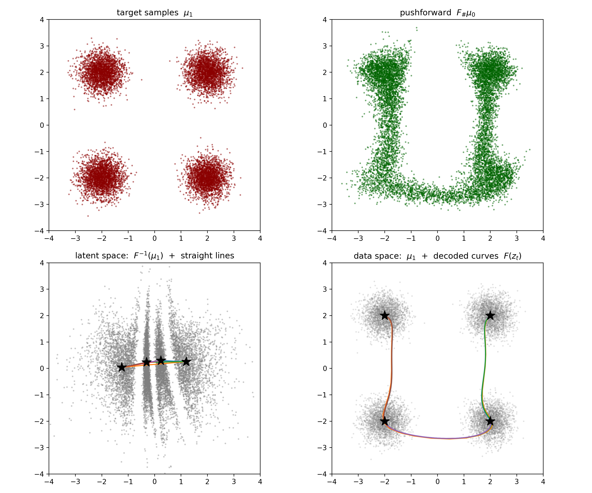

# 2D test: latent-space interpolation through a RealNVP bijection

We train a `RealNVP` on samples from a 4-corner Gaussian mixture and then exercise the bijection in the *inverse* direction — pulling data points back to the latent space, interpolating *linearly* there, and decoding the resulting trajectory through the forward map. This is the canonical RealNVP demonstration from Dinh et al. (2016), reduced to 2D so the latent and data spaces can both be plotted.

The point is not that RealNVP is the best density estimator on this target — `NSF` would converge faster and sharper — but that RealNVP's specific algorithmic strength is a *closed-form, O(d), exact* inverse. Every other public test in this folder uses only the forward map; this one is the only one that puts $F^{-1}$ in the foreground.

- **Source.** $\mu_0 = \mathcal N(0, I_2)$, the standard 2D Gaussian on $\mathbb R^2$. RealNVP lives natively on the unbounded plane, so there is no rectangular box to specify.
- **Target.** A 4-mode Gaussian mixture with means $(\pm 2, \pm 2)$ and shared variance $0.15$ — symmetric, well-separated, and visually distinct enough that interpolation paths between the modes can be tracked by eye.
- **Flow.** A `RealNVP` with `transforms=8` stacked affine-coupling layers (bumped from the default 4 because each affine coupling is a much weaker bijection than an NSF spline transform, and the 4-mode target needs the extra capacity) and a `(64, 64)` MLP per layer.

## Mathematical background

Forward KL training is identical to every other data-driven test in this folder. With $F = \mathrm{flow}.t()$ the bijection on $\mathbb R^2$,

$$
\mathcal L_{\mathrm{forward}}[F] = \mathbb E_{y \sim \mu_1}\bigl[\, U_0(F^{-1}(y)) + \log |\det J_F(F^{-1}(y))| \,\bigr].
$$

What is *new* is what we do once $F$ has been trained.

### The latent-interpolation construction

Pick anchor points $x_1, \dots, x_K \in \mathbb R^2$ in data space — here $K = 4$, the four mode centers. Map them to the latent space through the inverse,

$$
z_k = F^{-1}(x_k), \qquad k = 1, \dots, K.
$$

For each pair $(i, j)$, build a *straight* segment in latent space,

$$
z_t^{(ij)} = (1 - t)\, z_i + t\, z_j, \qquad t \in [0, 1],
$$

and decode by pushing it back through the forward map,

$$
x_t^{(ij)} = F\!\left(z_t^{(ij)}\right).
$$

Because $F$ is a smooth bijection, the curve $t \mapsto x_t^{(ij)}$ is a smooth path in data space joining $x_i$ and $x_j$. Whether it goes *through* the high-density region of $\mu_1$ or cuts through the low-density gaps depends entirely on what $F$ has learned: a well-trained flow stretches the latent space so that mass-rich regions of $\mu_1$ correspond to mass-rich regions of the source Gaussian, and any straight line in the latent that connects two source-Gaussian–dense points decodes to a curve in data space that hugs the data manifold.

### Why this is a RealNVP demonstration specifically

Every step above (`F^{-1}`, `F`, both at every interpolation point) needs to be cheap and exact:

- **NSF / NCSF**: forward and log-det are closed-form, but the inverse uses bisection per coordinate, with non-trivial latency.
- **CNF / FFJORD**: every $F$ and $F^{-1}$ call is an adaptive ODE integration with potentially hundreds of substeps; doing 50 of them per pair × 6 pairs would be visibly slow.
- **RealNVP**: forward, inverse, and log-determinant are *all* closed-form $O(d)$ — one MLP pass per coupling layer, in either direction. This is what makes the latent-interpolation demo cheap enough to be visualisable in a single script.

## Implementation and execution

The full pipeline lives in [`2D_RealNVP_latent_interpolation.py`](2D_RealNVP_latent_interpolation.py). Run from the project root:

```bash
python -m tests.2D_RealNVP_latent_interpolation
```

Pointers into the script:

- imports & device setup: [`2D_RealNVP_latent_interpolation.py:1-9`](2D_RealNVP_latent_interpolation.py#L1-L9)
- source ($\mathcal N(0, I_2)$) and 4-corner target mixture: [`2D_RealNVP_latent_interpolation.py:11-29`](2D_RealNVP_latent_interpolation.py#L11-L29)
- RealNVP init: [`2D_RealNVP_latent_interpolation.py:33`](2D_RealNVP_latent_interpolation.py#L33)
- training parameters: [`2D_RealNVP_latent_interpolation.py:35-39`](2D_RealNVP_latent_interpolation.py#L35-L39)
- training loop (mini-batched forward KL): [`2D_RealNVP_latent_interpolation.py:41-65`](2D_RealNVP_latent_interpolation.py#L41-L65)
- pull-back of anchors + round-trip sanity check: [`2D_RealNVP_latent_interpolation.py:67-83`](2D_RealNVP_latent_interpolation.py#L67-L83)
- 6-pair latent interpolation + decoding: [`2D_RealNVP_latent_interpolation.py:85-99`](2D_RealNVP_latent_interpolation.py#L85-L99)
- 2×2 plotting: [`2D_RealNVP_latent_interpolation.py:101-152`](2D_RealNVP_latent_interpolation.py#L101-L152)

The script asserts that the round-trip $F(F^{-1}(x_k)) \approx x_k$ on the four anchors holds to better than $10^{-4}$, which catches a broken inverse before it can produce nonsense interpolation curves.

<p align="center"></p>

## Analysis

**Top row — sanity check on training.**

- *(left, target $\mu_1$)*: four cleanly separated Gaussian blobs at $(\pm 2, \pm 2)$, as designed.
- *(right, pushforward $F_{\#}\mu_0$)*: the flow has clearly learned that mass should sit near the four corners — visible high-density bands track the target — but with `transforms=8` and 30 epochs of forward KL, density still bleeds across the gaps in a U-shape. This is a faithful illustration that *RealNVP is harder to train into sharp multimodal targets than NSF is*: each affine coupling layer can only stretch / shift one half of the coordinates as a function of the other half, and capturing four well-separated modes requires several layers to cooperate. Bumping `transforms` to 12 or extending `EPOCH` to 100 sharpens the four blobs noticeably — but the qualitative latent-interpolation story below survives even at modest training.

**Bottom-left — the latent space $F^{-1}(\mu_1)$.** The grey scatter shows the four target modes after the inverse map. Visible "stripes" of high latent density indicate that the flow has learned to map the four modes to four roughly co-located clusters in latent space (rather than spreading them isotropically across the latent Gaussian). This is *expected* for a forward KL-trained flow that has not fully converged: the inverse is correct in the strict bijective sense (every target point is uniquely mapped), but the latent density has not yet matched $\mathcal N(0, I_2)$. The four anchor stars sit on a near-horizontal line close to the origin; the six coloured straight segments are what we will decode.

**Bottom-right — decoded curves $F(z_t)$ in data space.** This is the payoff. The six trajectories are the *decoded* versions of the straight latent segments above. They are unambiguously *not* straight lines in data space: each curve

- starts at one anchor star,
- bends through the high-density region of $\mu_1$ (the grey background scatter),
- arrives at the other anchor star.

The curve from bottom-left to bottom-right hugs the bottom edge of the plot rather than cutting straight through the origin; the cross-diagonal curves bow outward through the lower modes; the lateral curves between same-$y$ corners trace gentle arcs through the mass-rich neighbourhood of those modes. This is exactly the morphing-through-the-data-manifold behaviour that made RealNVP famous in the image domain (Dinh et al., 2016, §5): a *linear* path in the learned latent space corresponds to a *geodesic-like* path in data space along the support of $\mu_1$.

**What this test demonstrates about `zflows`.**

- `RealNVP` exposes the same `flow.t()` interface as every other `Flow` subclass — `F.inv(y)` and `F(x)` are both closed-form, fast, and differentiable, and the script never has to reach into zuko internals.
- The `forward_KL(y, source=u0, flow=flow)` loss works unchanged across NSF, NCSF, CNF, and RealNVP — the same training loop transports between flow classes with a one-line constructor swap.
- The bijection contract holds numerically: the round-trip assertion at line 83 passes, confirming that for any anchor $x$ the inverse-then-forward returns $x$ to within floating-point precision. This is what makes the latent-interpolation demo *meaningful* rather than aesthetic — every decoded curve genuinely starts and ends at its anchor.

The test is the smallest example that puts the inverse direction in the foreground; combined with [`_RealNVP_interface.py`](_RealNVP_interface.py) (which verifies the bijection contract numerically) and [`2D_two_moon_CNF.md`](2D_two_moon_CNF.md) (which makes the closed-form-vs.-ODE trade-off concrete), it completes the picture of when each flow class is the right tool.
